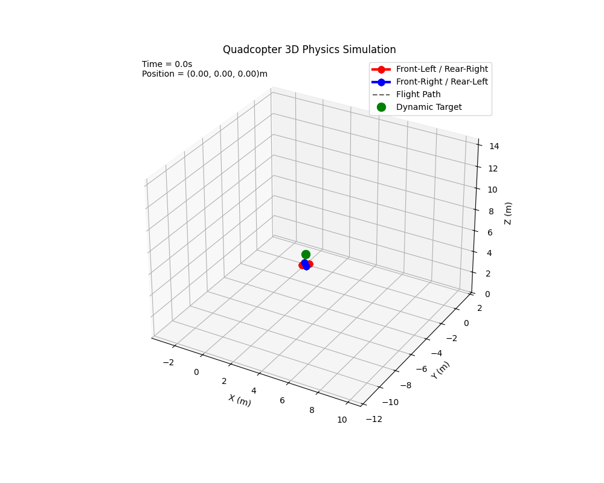

# 3D Quadcopter Flight Simulation

[](https://github.com/hunkarsuci/3d-quadcopter-simulation/actions/workflows/ci.yml)

A Python simulation of a quadcopter UAV with rigid-body dynamics, cascaded PID flight control, waypoint tracking, telemetry plots, and 3D flight animation.

The project models a quadrotor from first principles using Newton-Euler equations and a fourth-order Runge-Kutta integrator. It is intended as an educational simulation for understanding drone physics, control loops, and trajectory tracking.

## Features

- 12-state quadcopter model:
  - Position: `x, y, z`
  - Velocity: `vx, vy, vz`
  - Attitude: roll, pitch, yaw
  - Body rates: `p, q, r`
- RK4 physics integration for stable simulation at small timesteps.
- Cascaded PID controller:
  - Position loop
  - Altitude loop
  - Attitude loop
  - Angular-rate loop
- X-configuration motor mixer.
- Time-based waypoint missions.
- Telemetry plots for position, attitude, velocity, body rates, and motor thrust.
- 3D Matplotlib animation with flight trail and target marker.
- Smoke tests for basic dynamics and hover convergence.

## Demo Output

Running the main script generates a flight animation named:

```text
drone_flight.gif
```



Generated GIF files are ignored by default so large local outputs are not accidentally committed. The demo animation above is stored in `assets/drone_flight.gif` so it can be shown on GitHub.

## Project Structure

```text
drone_simulation/
|-- animate.py          # Telemetry plots and 3D animation
|-- controller.py       # PID and cascaded flight controller
|-- quadcopter.py       # Quadcopter rigid-body dynamics model
|-- simulator.py        # Waypoint simulation loop and history logging
|-- run_simulation.py   # Main runnable demo script
|-- test_smoke.py       # Basic simulation smoke tests
|-- requirements.txt    # Python dependencies
|-- LICENSE
`-- README.md
```

## Requirements

- Python 3.8+
- NumPy
- Matplotlib
- Pillow

Install dependencies with:

```bash
pip install -r requirements.txt
```

## Usage

Run the default waypoint mission:

```bash
python run_simulation.py
```

The script will:

1. Initialize the quadcopter model.
2. Create a cascaded PID flight controller.
3. Track a sequence of 3D waypoints.
4. Plot flight telemetry.
5. Save a 3D animation as `drone_flight.gif`.

## Running Tests

Run the smoke test suite:

```bash
python -m unittest test_smoke.py
```

The tests currently check:

- Hover convergence near a target altitude.
- Ballistic falling behavior under zero motor thrust.

## Simulation Model

The state vector is:

```text
[x, y, z, vx, vy, vz, phi, theta, psi, p, q, r]
```

Where:

- `x, y, z` are world-frame position coordinates.
- `vx, vy, vz` are world-frame velocities.
- `phi, theta, psi` are roll, pitch, and yaw Euler angles.
- `p, q, r` are body-frame angular rates.

The dynamics include:

- Gravity
- Thrust transformed from body frame to world frame
- Translational drag
- Rigid-body angular dynamics
- Motor-generated roll, pitch, and yaw torques
- Ground contact constraint

## Controller

The controller uses a cascaded architecture commonly found in UAV flight stacks:

```text
Position target -> desired roll/pitch
Altitude target -> total thrust
Attitude target -> desired body rates
Body-rate error -> torque commands
Torque + thrust commands -> individual motor forces
```

Motor forces are clipped to physical limits before being passed into the dynamics model.

## Example Mission

The default mission in `run_simulation.py` performs:

1. Take off to 1 meter.
2. Move forward while rotating yaw.
3. Move diagonally and climb.
4. Traverse sideways while turning.
5. Return near the origin.
6. Descend to ground level.

You can edit the `waypoints` list in `run_simulation.py` to create different trajectories.

## License

This project is licensed under the terms in `LICENSE`.
